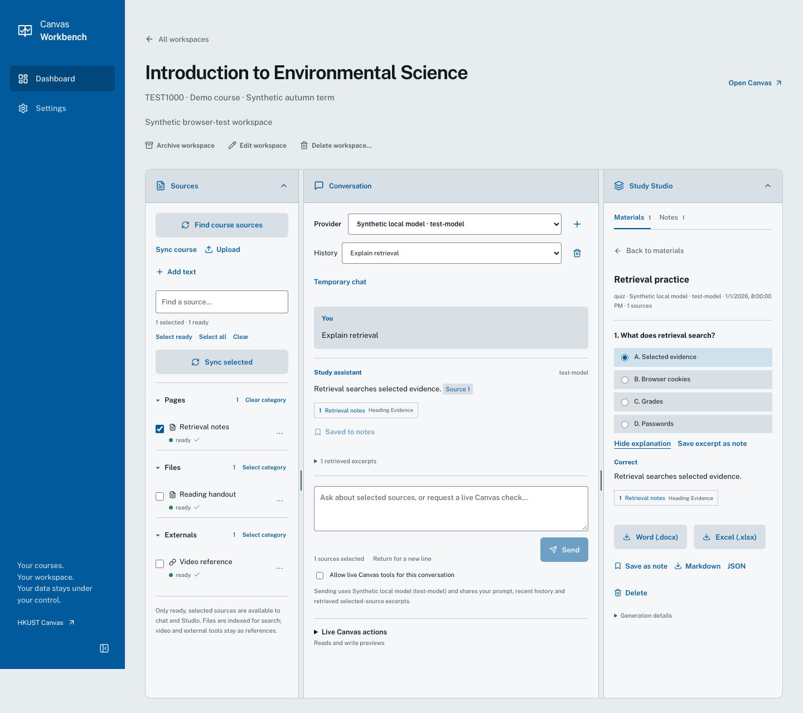
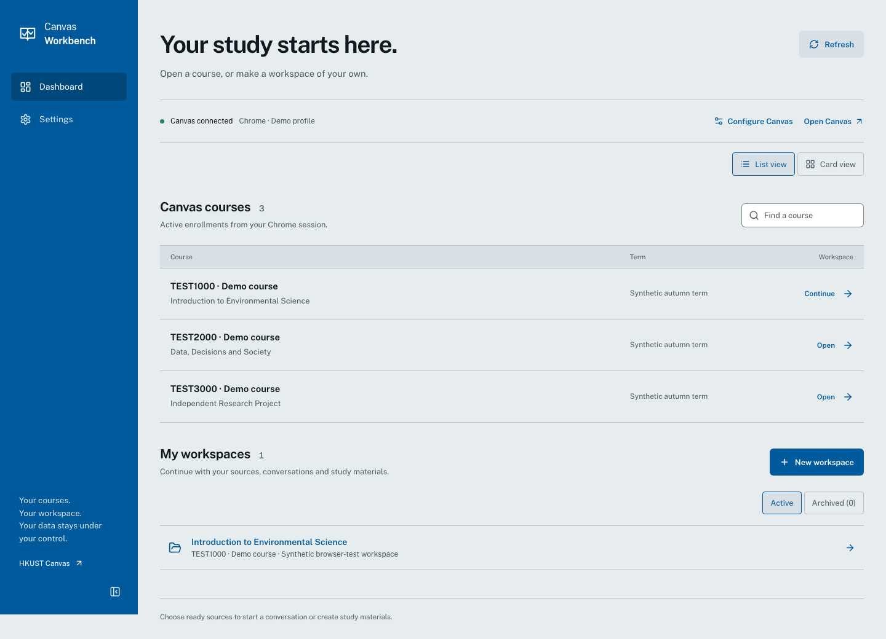
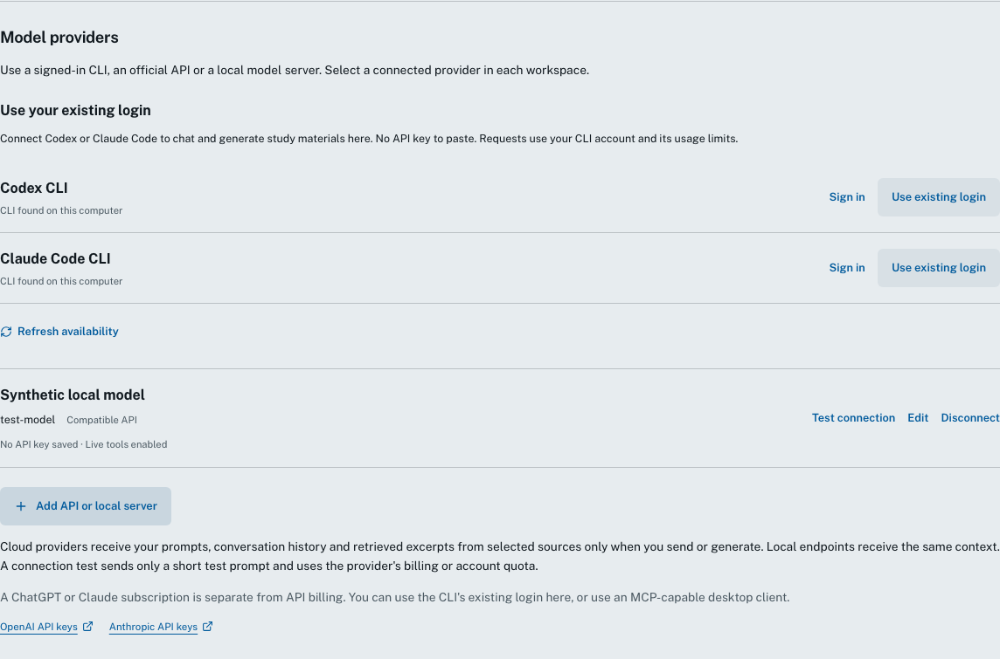
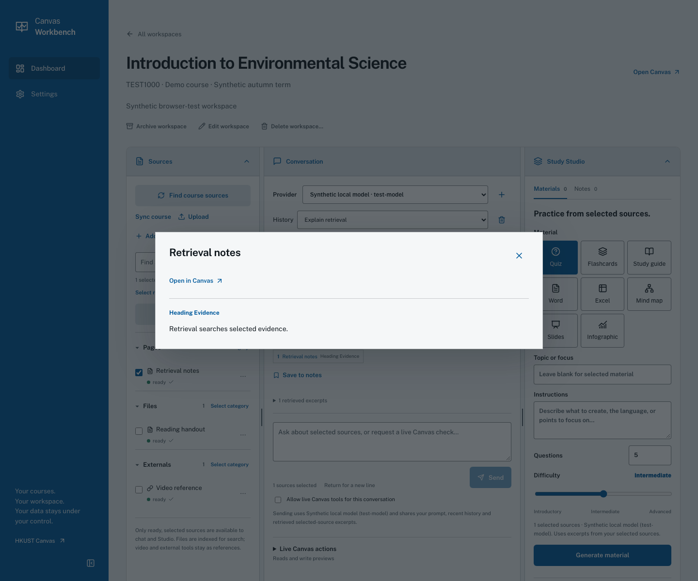
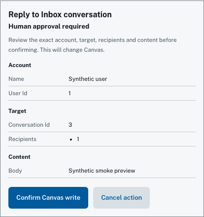

# HKUST Canvas Workbench

**Your Canvas. Your AI. Not just one model.**

Bring HKUST Canvas into the AI tools you already use — Claude, Codex,
OpenAI, Anthropic, local models, OpenAI-compatible endpoints, or any
compatible MCP client.

> **Unofficial, independent open-source project for HKUST Canvas users.**



**[Download for macOS · Apple Silicon](https://github.com/amzonmeeee/HKUST_Canvas_MCP/releases/tag/v3.0.0)** · [Developer install](docs/development.md) · [Security policy](SECURITY.md)

## What it does

- Open Canvas courses or create your own workspaces; archive and restore them.
- Select and sync sources, or add your own PDF, Word, PowerPoint, HTML, Markdown and text files.
- Ask questions with source citations; inspect supporting excerpts and open originals in Canvas.
- Make quizzes, flashcards, study guides, mind maps, slides, infographics, Word documents and spreadsheets. Save notes and export materials.
- Use saved or temporary conversations; save a temporary conversation when you want to keep it.
- Check current Canvas information and preview supported writes before confirming them.
- Access Canvas through the browser, CLI or an MCP client.

## Why this exists

HKUST now offers an AI learning platform [connected to Canvas](https://www.hkgai.org/products), powered by
**HKGAI-V3 — [based on DeepSeek V4](https://www.scmp.com/tech/tech-trends/article/3355861/hong-kong-launches-deepseek-based-ai-model-designed-run-domestic-chips)**. The “sources + chat + study outputs”
experience will look familiar to anyone who has used NotebookLM.

**The difference here is that the model is yours to choose.**

Use the same HKUST Canvas data with Claude, Codex, OpenAI, Anthropic,
local models, OpenAI-compatible endpoints, or any MCP-capable client —
with local ownership, open-source transparency, and no dependency on a
single AI stack.

## 60-second setup

1. Download the Apple Silicon `.dmg` from the [v3.0.0 release](https://github.com/amzonmeeee/HKUST_Canvas_MCP/releases/tag/v3.0.0). Open it and drag **HKUST Canvas Workbench.app** to Applications.
2. Open the app.

   Because v3.0.0 is not yet Developer ID signed or notarized, macOS may
   block the first launch. If it does, go to:

   **System Settings → Privacy & Security → Open Anyway**

   Approve it only if you downloaded the app from this repository's
   official release page. You do not need to disable Gatekeeper.

   The app opens your default browser and keeps a Dock icon while the service runs.
3. Choose the Chrome profile you normally use for Canvas. Click **Check connection** and verify the account shown. If needed, open `canvas.ust.hk` in Chrome, sign in normally, then retry. The app does not automate SSO.
4. Connect an already signed-in Codex/Claude Code CLI, add an API/local provider, or **skip for now**. Review the sharing notice and finish setup.
5. Open a course, **Find course sources**, select and sync sources, choose a provider, then ask a question.

Change the Chrome profile, disconnect a provider or revisit setup in **Settings**. The dashboard also has **Configure Canvas**. Quit through the app menu or ⌘Q to stop the service; closing a browser tab leaves the app running. Reopening the app reuses its existing local service.

### Opening this first macOS release

This release has no Apple Developer ID signature or notarization. Download only from this repository's release page; compare its SHA-256 checksum with `SHA256SUMS` to verify the file.

If Gatekeeper blocks it, first try opening the app, then use **System Settings → Privacy & Security → Open Anyway** if you trust the download. Follow [Apple's opening guidance](https://support.apple.com/en-au/102445). Do not disable Gatekeeper globally. A managed Mac may need its administrator's approval.

## Screenshots

These demonstrations use synthetic courses, sources, users and model responses. They contain no student records or private course material.

**Dashboard — courses and saved workspaces**



**Provider setup — existing CLI login, API or local endpoint**



**Citation inspection — check the excerpt used in an answer**



**Write safety — exact account, target and payload before confirmation**



## Safety and privacy

**Your Canvas session stays local.** The app uses your existing signed-in Chrome
Canvas session. Cookies and Canvas CSRF credentials stay in the Python backend;
they are not returned to the browser frontend or sent to AI providers. Sources
are extracted, stored and indexed locally.

When you send or generate, a cloud provider receives your prompt, relevant
conversation history and retrieved excerpts from selected sources, rather than
an automatic upload of the full course. Explicitly enabled live tools can also
supply requested Canvas results. A local model receives the same context on its
configured server; a server on your computer can keep model processing there.
Temporary chat does not change a provider's data policy.

API keys use the system credential store with no plaintext fallback; stored
keys are not returned to the frontend or committed to this repository. Codex
and Claude Code use their supported CLI login without copying authentication
tokens. Connection tests send a short prompt and may use billing or account quota.

Canvas writes require an exact preview and explicit confirmation.
**External MCP clients are read-only by default.** Enabling write tools does not
approve an action. Verify important submissions, grades and deadlines in Canvas.

You are responsible for ensuring that your use of course materials, connected
services, and AI providers complies with applicable institutional policies,
service terms, and any rights or restrictions that apply to those materials.

See the [Privacy summary](PRIVACY.md) for data flows and the
[Security policy](SECURITY.md) for technical safeguards, unlink/disconnect behavior
and private reporting. Never attach cookies, tokens, keys, private exports or
unredacted logs to public issues.

## Supported AI providers

| Component | Validation for this release |
| --- | --- |
| Apple Silicon macOS app | Built and smoke-tested on macOS 27.0.1 and fresh macOS 15 CI; isolated HOME, native Quit, restart and singleton tests. Downloaded-file Gatekeeper approval remains a manual check. |
| Chrome / multiple profiles | HKUST read/sync smoke during v3 development; synthetic connect, expiry, unlink and reconnect tests. Chrome must already be signed in. |
| Codex CLI | Real login, short streaming and structured output tested during v3 development; release CI uses synthetic adapters. |
| Claude Code CLI | Implemented and tested with synthetic adapters; real signed-in inference not verified. |
| Claude Desktop / Codex app | MCP configuration contracts tested; live desktop accounts not verified. Settings → MCP clients. |
| OpenAI / Anthropic API | Official streaming/tool/schema and failure contracts tested; paid-account access not verified. API billing is separate from a chat subscription. |
| Compatible API / Ollama / LM Studio | Compatible gateway smoke-tested over loopback. Configure model and endpoint; particular local model installations are not certified. |
| Windows / Linux | Python/package tests and fresh wheel install pass on Ubuntu 24.04 CI; no Linux desktop installer. Windows is a developer route without platform validation. |

Choose the model identifier yourself. Local endpoints must already be running. Scanned PDFs need OCR elsewhere; v3 does not provide OCR, transcription or authenticated LTI/external-site extraction. Sync and parsing limits are in the [implementation reference](docs/v3-workbench.md).

## Use it with Claude, Codex and any MCP client

In **Settings → MCP clients**, connect a detected desktop app or copy the setup/configuration. The macOS app supplies an absolute path to its bundled MCP executable, so no separate Python package installation is needed. Keep the app in a stable location before configuring clients.

The local web workbench and MCP are separate interfaces. Claude, Codex and other MCP clients can use Canvas tools independently of the workbench's AI provider. To chat **inside this workbench**, choose a provider in the workspace; MCP configuration alone does not select a chat provider.

For a developer installation:

```sh
canvas-mcp --transport stdio --read-only
```

To opt into writes, deliberately replace `--read-only` with `--allow-writes`; read-only overrides an environment opt-in. Obtain human approval for each exact preview before using confirmation tools. The direct CLI retains its v2 preview/confirmation commands. See [developer setup](docs/development.md) and the [CLI reference](docs/cli.md).

<a id="install"></a>

## Installation options

- **macOS app:** download the DMG or zipped `.app`. Both include the frontend and Python runtime.
- **Python package:** release wheel and source distribution are available for developers. Install the wheel with its `[web]` extra in a virtual environment, then run `canvas web`. Node is needed only to rebuild the frontend.
- **Source checkout:** follow [developer installation](docs/development.md). [Release engineering](docs/releasing.md) describes the build and checks.

Updating the application preserves study data. Never replace or remove your data folder just to update the app.

## Troubleshooting

| Problem | Next step |
| --- | --- |
| No Canvas session / expired session | Sign in normally in Chrome, verify the profile, then Check connection. |
| Chrome asks for credential access | Allow only if you trust the app and selected profile. Recheck the account. |
| No provider in a workspace | Connect one in Settings, then choose it in the workspace. MCP setup is separate. |
| API connection fails | Check model, quota and credential. For local servers, check endpoint and running model. |
| App cannot start | Use Show logs / Retry / Quit. Share only redacted metadata, never session links. |
| Default port occupied | The launcher chooses a free loopback port. Do not expose it on your network. |
| Write result uncertain | Check Canvas before another preview. Confirmations are single-use; ambiguous writes are not retried automatically. |
| Older web build rejects database | Use v3.0.0; schema 6 preserves data but older builds cannot open it. |

## Uninstall

1. **Credentials:** disconnect API providers in Settings to remove only their app-owned credential-store items. This does not sign out CLI accounts.
2. **Canvas:** unlink if you want the shared CLI/MCP profile binding removed. Chrome login and browser data are unaffected.
3. **Application:** quit, then move the app to Trash. Remove its MCP entry from clients if configured.
4. **Study data, optional:** back up wanted work, then remove `~/Library/Application Support/HKUST_Canvas_MCP`. This permanently deletes sources, conversations, notes and artifacts, separately from removing the app or unlinking Canvas.
5. **Profile settings, optional:** the app-owned binding lives in `~/.config/canvasmcp/settings.json` (or under `XDG_CONFIG_HOME`), shared with CLI/MCP. Do not remove Chrome profiles or cookies.

If the app is already gone, its API credentials are system credential-store entries under `HKUST_Canvas_MCP.providers`, keyed by provider ID. Remove only those entries; never clear your whole Keychain. Launcher logs/session metadata are inside the app data folder.

## Roadmap

For v3.1 or later: read-only MCP access to saved workspaces, indexed sources, search and artifacts, so external agents can use the same materials as the browser. These tools are planned, not included in v3.0. Signing/notarization and broader platform testing are next steps.

## Disclaimer

HKUST Canvas Workbench is an unofficial, independent open-source project
and is not affiliated with or endorsed by HKUST, Instructure, or any
supported AI provider. The software is provided as-is, without warranty.

AI-generated content and synchronized Canvas data may be incomplete,
delayed, or incorrect. Always verify critical submissions, deadlines,
grades, and other academic records directly in Canvas.

You are responsible for complying with applicable institutional
policies, service terms, and restrictions on the materials you process.

See the [MIT License](LICENSE) and [Security policy](SECURITY.md).

## Original project and acknowledgements

Built on [ynbh/canvasmcp](https://github.com/ynbh/canvasmcp), independently maintained by amzonmeeee for HKUST Canvas. The original CLI, MCP tools, Chrome-session authentication and tests form the foundation; the original copyright notice remains in [LICENSE](LICENSE).

Thanks to [vishalsachdev/canvas-mcp](https://github.com/vishalsachdev/canvas-mcp) for informing submission status, peer review, Inbox, discussion, comment, module completion and course structure workflows. These additions use Canvas's official APIs.

MIT licensed; see [LICENSE](LICENSE) for the original and derivative-work copyright notices.
